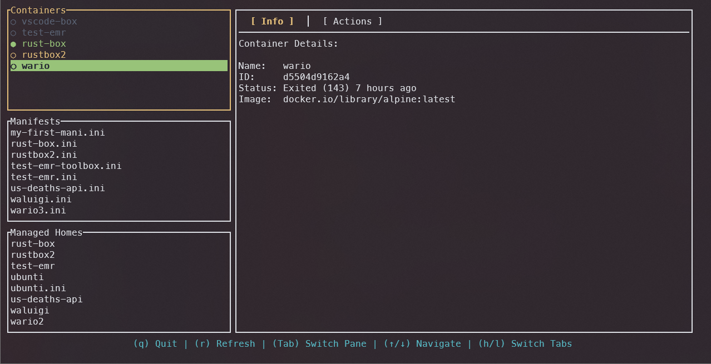
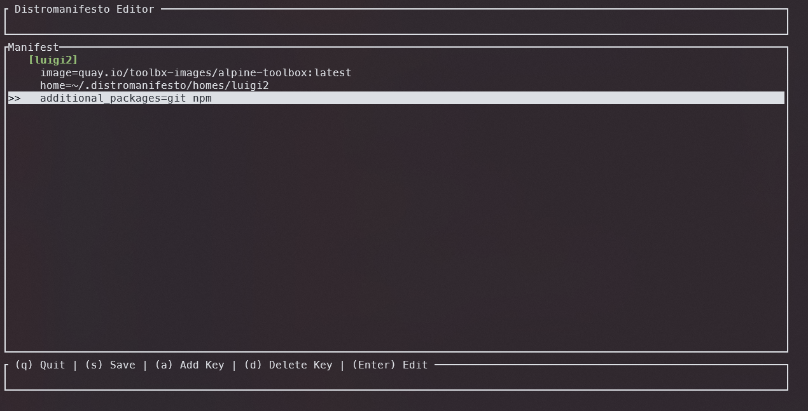

# Distromanifesto (dimo)

> A friendly wizard for creating and managing Distrobox manifest files.




**Distromanifesto** (alias: `dimo`) is a wrapper for [Distrobox](https://distrobox.it/) that brings **Declarative Configuration** and a **TUI Management Dashboard** to your container workflow.

Stop memorizing complex CLI flags. Define your containers in simple `.ini` files and manage them with a modern terminal interface.

---

## 📚 Documentation

**[Read the Full Documentation](https://dorbro555.github.io/distromanifesto/)**
*Complete guides on Installation, Schema, and Usage.*

---

## ✨ Features

* **📄 Declarative Manifests**: Define your containers as code. Share your dev environment with a single `.ini` file.
* **🧙 Interactive Wizard**: Create new complex container configurations using a friendly step-by-step TUI (`dimo create`).
* **🖥️ The Cauldron**: A centralized dashboard to view running containers, manage manifest files, and clean up storage (`dimo cauldron`).
* **🔧 Power User Control**: Supports advanced Distrobox features like `init_hooks`, `nvidia` GPU support, and custom `home` directories.
* **⚡ Lightning Fast**: Built in Rust.



## 📦 Installation

### Prerequisites
* **Distrobox** installed.
* **Podman** or **Docker** installed and running.

### Via Cargo
```bash
cargo install distromanifesto
```

### Build from Source
```bash
git clone [https://github.com/dorbro555/distromanifesto](https://github.com/dorbro555/distromanifesto)
cd distromanifesto
cargo install --path cli
```

## 🚀 Quick Start

1. Create a Manifest
Run the wizard to generate your first configuration:
```bash
dimo create
```
*Follow the interactive prompts to define your image, packages, and hooks.*

2. Assemble the Container
Build the container defined in your new manifest:
```bash
dimo assemble my-box.ini
```

3. Manage with The Cauldron
Launch the TUI dashboard to manage your ecosystem:
```bash
dimo cauldron
```

- Navigation: `j`/`k` or Arrow Keys
- Tabs: `Tab` to switch between Containers, Manifests, and Homes.
- Actions: `e` to Enter shell, `s` to Stop, `d` to Delete.

## 📄 Manifest Example
You can also write manifests by hand. Save this as `dev.ini`:
```Ini,TOML
[rust-dev]
image=archlinux:latest
pull=true
init=true
additional_packages=git neovim ripgrep gcc
init_hooks=echo "Dev environment ready!"
nvidia=true
```

Then run: `dimo assemble dev.ini`

## 🤝 Contributing
Contributions are welcome! Please check out the issues tab.

## 📄 License
This project is licensed under the MIT License.